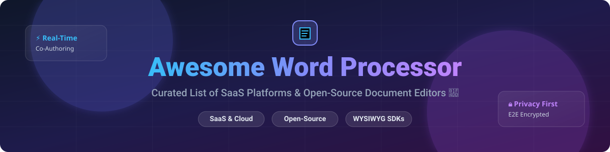

# Awesome Word Processor 📝 

## Top Word Processor & Document Authoring Ecosystem 🚀

   

A curated list of top SaaS products, cloud platforms, and open-source GitHub projects focused on document authoring, real-time collaboration, rich text editing, and office format interoperability (DOCX, ODF, PDF).

**Last updated:** October 2026 📅

---

## 💡 Market Overview & Industry Insights 📈

The global Word Processing & Document Management Software market size is estimated at **$28.5 Billion in 2026** and is projected to reach **$49.2 Billion by 2031**, growing at a CAGR of ~11.5%. 

**Market Structure:** The industry is **highly concentrated** at the enterprise tier (dominated by Microsoft 365 and Google Workspace taking over 80% market share), while remaining **moderately fragmented** in specialized niches (academic publishing, privacy-first editing, self-hosted open-source document servers, and developer WYSIWYG SDKs).

---

## 📋 Table of Contents

- [☁️ SaaS & Hosted Platforms](#️-saas--hosted-platforms)
- [🔓 Open-Source GitHub Projects](#-open-source-github-projects)
- [🛠️ Developer Frameworks & WYSIWYG SDKs](#️-developer-frameworks--wysiwyg-sdks)
- [🤝 How to Contribute](#-how-to-contribute)
- [💖 Support](#-support)
- [⭐ Star History](#-star-history)
- [⚠️ Disclaimer](#️-disclaimer)

---

## ☁️ SaaS & Hosted Platforms

Below is a curated comparison of leading SaaS word processors, sorted by company revenue/valuation (descending).

| Platform 🌐 | Scale / Revenue / Valuation 💰 | Starting Tier Price 🏷️ | Free Tier / Trial Limit 🎁 | Key Features & Focus Areas 🎯 |
| :--- | :--- | :--- | :--- | :--- |
| **[Microsoft Word](https://www.microsoft.com/microsoft-365/word)** | **~$245 Billion** (MS FT 365 Revenue) | **$6.00 / user / month** (Microsoft 365 Business Basic) | **Free web version** (Word for Web with 5GB OneDrive storage) | Industry standard document authoring, track changes, mail merge, Zotero/Mendeley integration, Copilot AI. |
| **[Google Docs](https://docs.google.com/)** | **~$350+ Billion** (Alphabet Cloud & Workspace Revenue) | **$6.00 / user / month** (Google Workspace Business Starter) | **100% Free for personal use** (15GB shared Google Drive storage) | Gold standard in real-time co-authoring, cloud-native accessibility, version history, Gemini AI integration. |
| **[Salesforce Quip](https://quip.com/)** | **~$38 Billion** (Salesforce Annual Revenue) | **$10.00 / user / month** (Quip Starter) | **14-day free trial** (Full feature access during trial period) | Deep Salesforce CRM integration, collaborative documents embedded with live spreadsheet data & team chat. |
| **[Dropbox Paper](https://www.dropbox.com/paper)** | **~$2.5 Billion** (Dropbox Annual Revenue) | **$9.99 / month** (Dropbox Plus) | **Free for Dropbox users** (Limited by standard 2GB Dropbox account space) | Minimalist collaborative document workspace, rich media embeds, clean meeting notes & task management. |
| **[Notion](https://www.notion.so/)** | **~$10.0 Billion** (Market Valuation) | **$8.00 / user / month** (Notion Plus Plan) | **Free Plan** (Unlimited blocks for individuals, 5MB file upload limit) | All-in-one workspace combining modular rich-text documents, wikis, relational databases, and AI writing. |
| **[Zoho Writer](https://www.zoho.com/writer/)** | **~$1.4 Billion** (Zoho Corp Revenue) | **$3.00 / user / month** (Zoho Workplace Standard) | **Free Plan** (Up to 5 users, 5GB storage per user) | Clean distraction-free interface, Zia AI writing assistant, offline editing, strong privacy controls. |
| **[WPS Office Writer](https://www.wps.com/)** | **~$700 Million** (Kingsoft Office Revenue) | **$2.99 / month** or **$29.99 / year** (WPS Pro) | **Free Version** (Ad-supported, full core editing features & 1GB cloud space) | High Microsoft Word DOCX UI & format fidelity, built-in PDF tools, tabbed document editing interface. |
| **[Scrivener](https://www.literatureandlatte.com/scrivener/overview)** | **~$15 Million** (Literature & Latte Revenue) | **$59.99 one-time purchase** (Standard Desktop License) | **30-day free trial** (30 actual days of use allowed before license required) | Tailored for long-form manuscripts, novels, and theses; corkboard outlining, binder structure, compile engine. |

---

## 🔓 Open-Source GitHub Projects

Open-source document editors provide data sovereignty, privacy, and self-hosting options. Below are top repositories sorted by **GitHub_Stars (descending)**.

| Project & Repository 📦 | GitHub_Stars 🌟 | License 📜 | Description & Highlights 🚀 |
| :--- | :--- | :--- | :--- |
| **[AppFlowy](https://github.com/AppFlowy-IO/AppFlowy)** |  | AGPL-3.0 | Open-source alternative to Notion. Built with Flutter and Rust for high performance, document privacy, and local-first data ownership. |
| **[Logseq](https://github.com/logseq/logseq)** |  | AGPL-3.0 | Local-first, privacy-focused open-source knowledge base and outliner word processor supporting Markdown and Org-mode. |
| **[Outline](https://github.com/outline/outline)** |  | BSL-1.1 / MIT | Beautiful, fast, open-source collaborative team wiki and structured document workspace built with React and Node.js. |
| **[Etherpad Lite](https://github.com/ether/etherpad-lite)** |  | Apache-2.0 | Lightweight real-time collaborative text editor with minimal memory footprint, instant setup, multi-author colors, and rich plugin ecosystem. |
| **[CryptPad](https://github.com/cryptpad/cryptpad)** |  | AGPL-3.0 | End-to-end encrypted, zero-knowledge open-source collaborative document suite ensuring complete privacy from host servers. |
| **[HedgeDoc](https://github.com/hedgedoc/hedgedoc)** |  | AGPL-3.0 | Real-time collaborative Markdown document editor (formerly CodiMD), ideal for technical documentation and quick notes. |
| **[OnlyOffice DocumentServer](https://github.com/ONLYOFFICE/DocumentServer)** |  | AGPL-3.0 | Enterprise open-source office server offering native OOXML (DOCX) compatibility, real-time co-authoring, Nextcloud integration, and track changes. |
| **[LibreOffice Core](https://github.com/LibreOffice/core)** |  | MPL-2.0 | The flagship open-source desktop word processor engine powering LibreOffice Writer. De facto open standard for ODF document authoring. |
| **[Collabora Online](https://github.com/CollaboraOnline/online)** |  | MPL-2.0 | Cloud-based enterprise document editor bringing LibreOffice Writer's full power to web browsers with Nextcloud/ownCloud integration. |
| **[Koodo Reader](https://github.com/koodo-reader/koodo-reader)** |  | GPL-3.0 | Open-source document and ebook reader with built-in annotation, text highlight, and document review notes. |

---

## 🛠️ Developer Frameworks & WYSIWYG SDKs

For developers seeking to embed customizable word processing engines into custom web applications:

| Framework 🧰 | GitHub_Stars 🌟 | License 📜 | Description 📝 |
| :--- | :--- | :--- | :--- |
| **[Quill JS](https://github.com/quilljs/quill)** |  | BSD-3-Clause | Powerful rich text editor built for compatibility and customizability with a modular architecture. |
| **[Tiptap](https://github.com/ueberdosis/tiptap)** |  | MIT | Headless WYSIWYG editor framework for Vue.js and React built on ProseMirror. |
| **[Slate JS](https://github.com/ianstormtaylor/slate)** |  | MIT | Completely customizable framework for building rich text editors in React applications. |

---

## 🤝 How to Contribute

Contributions are warmly welcomed! Help us keep this list up to date and comprehensive:

1. 🍴 **Fork** this repository.
2. 📝 **Add/edit** entries in `README.md` keeping formatting consistent.
3. 🔍 Provide accurate descriptions, official links, pricing details, and licenses.
4. 🚀 Submit a **Pull Request** with a concise summary of changes.

---

## 💖 Support

Thank you for visiting and using this repository! If you find this curated word processor list helpful, please consider supporting the project:

- ⭐ **Star** this repository to show your appreciation and help others discover it!
- 🔀 **Fork** and share it with fellow writers, developers, and researchers.
- ☕ **Sponsor**: Support ongoing maintenance via [GitHub Sponsors](https://github.com/sponsors/ishandutta2007).

---

## ⭐ Star History

---

## ⚠️ Disclaimer

- This list is **community-curated** for informational and research purposes only.
- Word processors handle confidential business and personal data. Always conduct security audits before deploying self-hosted instances.
- **CryptPad's zero-knowledge architecture** means lost passwords cannot be recovered.
- Product pricing and Stars_Counts are updated periodically.

---

**Made with ❤️ for writers, software engineers, legal professionals, and privacy enthusiasts.**
